# Plan: Tarea 1.3 - API Routes para Leads (GET, POST)

## Contexto

Tarea SOY-7 de Linear: crear `src/app/api/leads/route.ts` con GET (listado paginado) y POST (creación).

**Hito 1**: El modelo Lead NO tiene `tenantId`. Usar `withAuth` (no `withAuthAndTenant`).

## Hallazgos del repositorio

### 1. Formato de respuesta paginada

El cliente API en [src/lib/api.ts](src/lib/api.ts) y los tipos en [src/types/api.ts](src/types/api.ts) definen:

```typescript
// src/types/api.ts
interface PaginatedResponse<T> {
  data: T[]
  pagination: {
    page: number
    limit: number
    total: number
    totalPages: number
  }
}
```

El cliente usa `parseResponse` que extrae `data.data ?? data`. Por tanto, la API debe devolver:

```json
{
  "data": [...leads],
  "pagination": {
    "page": 1,
    "limit": 10,
    "total": 150,
    "totalPages": 15
  }
}
```

Usar `successResponse({ data: leads, pagination: {...} })` para que el wrapper final sea `{ data: { data, pagination } }` y el cliente reciba correctamente `PaginatedResponse<Lead>`.

### 2. API client ya preparado

[src/lib/api.ts](src/lib/api.ts) ya tiene:

- `api.getLeads(filters)` - espera `PaginatedResponse<Lead>`
- `api.createLead(data)` - espera `Lead`

Los filtros soportados: page, limit, estado, origen, search, sortBy, sortOrder, fechaDesde, fechaHasta.

Para la tarea 1.3 el mínimo es: page, limit, estado, origen. Opcional: search, sortBy, sortOrder.

### 3. leadSchema y Prisma

[src/lib/validators.ts](src/lib/validators.ts): leadSchema tiene nombre, telefono (requeridos), dni, email, ingresos, zona, producto, monto, origen, estado, notas.

[prisma/schema.prisma](prisma/schema.prisma): Lead tiene ingresos y monto como `Int?`. El schema usa `z.number()`; conviene añadir `.int()` o transformar a entero antes de `create` para evitar errores de Prisma.

Campos opcionales en Prisma no presentes en leadSchema: cuil, agencia, banco, trabajo_actual. Para Hito 1 no son necesarios; quedarán null.

### 4. handleApiError y formato de error

[src/lib/api-helpers.ts](src/lib/api-helpers.ts) devuelve para Zod:

```json
{
  "error": {
    "code": "VALIDATION_ERROR",
    "message": "Error de validación",
    "details": [/* Zod errors */]
  }
}
```

Compatible con el cliente. No requiere cambios.

### 5. Rate limit

[src/lib/rate-limit.ts](src/lib/rate-limit.ts): `rateLimitByIp` y `rateLimitByTenant`. Sin tenant en Hito 1, usar `rateLimitByIp(200, 60000)`.

---

## Implementación

### Archivo: [src/app/api/leads/route.ts](src/app/api/leads/route.ts)

```mermaid
flowchart TB
    subgraph GET [GET /api/leads]
        G1[withAuth]
        G2[rateLimitByIp]
        G3[validateQuery: page, limit, estado, origen]
        G4[db.lead.findMany + count]
        G5[successResponse data + pagination]
        G1 --> G2 --> G3 --> G4 --> G5
    end
    
    subgraph POST [POST /api/leads]
        P1[withAuth]
        P2[rateLimitByIp]
        P3[validateRequest leadSchema]
        P4[Transform: email ''->null, ingresos/monto int]
        P5[db.lead.create]
        P6[successResponse lead 201]
        P1 --> P2 --> P3 --> P4 --> P5 --> P6
    end
```




### GET - Query schema

```typescript
const leadsQuerySchema = z.object({
  page: z.coerce.number().int().positive().default(1),
  limit: z.coerce.number().int().positive().max(100).default(10),
  estado: z.enum(['NUEVO', 'EN_REVISION', 'PREAPROBADO', 'RECHAZADO', 'DOC_PENDIENTE', 'DERIVADO']).optional(),
  origen: z.enum(['whatsapp', 'instagram', 'facebook', 'comentario', 'web', 'ads']).optional(),
})
```

### GET - Response

```typescript
return successResponse({
  data: leads,
  pagination: {
    page: params.page,
    limit: params.limit,
    total,
    totalPages: Math.ceil(total / params.limit),
  },
})
```

### POST - Transformación antes de create

```typescript
const toCreate = {
  nombre: validated.nombre,
  telefono: validated.telefono,
  email: validated.email && validated.email !== '' ? validated.email : null,
  dni: validated.dni || null,
  ingresos: validated.ingresos != null ? Math.floor(validated.ingresos) : null,
  monto: validated.monto != null ? Math.floor(validated.monto) : null,
  zona: validated.zona || null,
  producto: validated.producto || null,
  origen: validated.origen || null,
  estado: validated.estado ?? 'NUEVO',
  notas: validated.notas || null,
}
```

### Imports necesarios

```typescript
import { NextRequest } from 'next/server'
import { z } from 'zod'
import { withAuth, successResponse, validateRequest, validateQuery } from '@/lib/api-helpers'
import { leadSchema } from '@/lib/validators'
import { logger } from '@/lib/logger'
import { rateLimitByIp } from '@/lib/rate-limit'
import { db } from '@/lib/db'
```

---

## Criterios de aceptación (SOY-7)

- GET /api/leads devuelve lista paginada (data, pagination con total, page, limit, totalPages)
- POST /api/leads crea lead y devuelve 201 con el lead creado
- Validación Zod; errores 400 manejados por handleApiError

---

## Referencias

- [src/types/api.ts](src/types/api.ts) - PaginatedResponse, CreateLeadRequest
- [src/lib/api.ts](src/lib/api.ts) - Cliente que consumirá la API
- [.cursor/skills/create-api-route/SKILL.md](.cursor/skills/create-api-route/SKILL.md) - Template (adaptar: withAuth, sin tenantId)
- [docs/API.md](docs/API.md) - Especificación (formato pagination puede diferir; priorizar types/api.ts)

