# Diagramas - CRM Inmobiliario STRATO

## 📊 Índice

1. [Diagrama de Base de Datos](#diagrama-de-base-de-datos)
2. [Diagrama de Arquitectura](#diagrama-de-arquitectura)
3. [Diagrama de Flujo de Datos](#diagrama-de-flujo-de-datos)
4. [Diagrama de Componentes](#diagrama-de-componentes)
5. [Diagrama de Flujo de Usuario](#diagrama-de-flujo-de-usuario)

## 🗄️ Diagrama de Base de Datos

### Modelo Entidad-Relación (ERD)


### Esquema Relacional (Primera Etapa)

**Tabla: leads**
```
- id (PK, String, CUID)
- nombre (String, NOT NULL)
- dni (String, UNIQUE, NULLABLE)
- cuil (String, NULLABLE)
- telefono (String, NOT NULL, INDEXED)
- email (String, NULLABLE)
- ingresos (Int, NULLABLE)
- zona (String, NULLABLE)
- producto (String, NULLABLE)
- monto (Int, NULLABLE)
- origen (String, NULLABLE, INDEXED)
- utmSource (String, NULLABLE)
- estado (String, DEFAULT 'NUEVO', INDEXED)
- agencia (String, NULLABLE)
- banco (String, NULLABLE)
- trabajo_actual (String, NULLABLE)
- notas (String, NULLABLE)
- whatsappId (String, UNIQUE, NULLABLE, INDEXED)
- tags (String, NULLABLE)
- customFields (String, NULLABLE, JSON)
- createdAt (DateTime, DEFAULT NOW(), INDEXED)
- updatedAt (DateTime, AUTO UPDATE)
```

**Tabla: events**
```
- id (PK, String, CUID)
- leadId (FK → leads.id, NULLABLE, INDEXED)
- tipo (String, INDEXED)
- payload (String, NULLABLE, JSON)
- createdAt (DateTime, DEFAULT NOW(), INDEXED)
```

**Tabla: users**
```
- id (PK, String, CUID)
- nombre (String, NOT NULL)
- email (String, UNIQUE, NOT NULL)
- hash (String, NOT NULL)
- rol (String, DEFAULT 'VENDEDOR')
- createdAt (DateTime, DEFAULT NOW())
```

**Tabla: conversations** (Para futuras etapas)
```
- id (PK, String, CUID)
- leadId (FK → leads.id, NULLABLE)
- platform (String, NOT NULL)
- platformId (String, NOT NULL)
- status (String, DEFAULT 'open', INDEXED)
- assignedTo (FK → users.id, NULLABLE, INDEXED)
- lastMessageAt (DateTime, DEFAULT NOW(), INDEXED)
- whatsappData (String, NULLABLE, JSON)
- phoneNumberId (String, NULLABLE)
- createdAt (DateTime, DEFAULT NOW())
- updatedAt (DateTime, AUTO UPDATE)
- UNIQUE(platform, platformId)
```

## 🏗️ Diagrama de Arquitectura

### Arquitectura General


### Arquitectura de Capas


## 🔄 Diagrama de Flujo de Datos

### Flujo: Crear Lead

```mermaid
sequenceDiagram
    participant U as Usuario
    participant C as Componente LeadForm
    participant V as Validator (Zod)
    participant API as API Route
    participant P as Prisma
    participant DB as PostgreSQL
    participant T as Toast Notification
    
    U->>C: Completa formulario
    U->>C: Click "Guardar"
    C->>V: Validar datos (cliente)
    V-->>C: Datos válidos
    C->>API: POST /api/leads
    API->>V: Validar datos (servidor)
    V-->>API: Datos válidos
    API->>P: db.lead.create()
    P->>DB: INSERT INTO leads
    DB-->>P: Lead creado
    P-->>API: Lead object
    API-->>C: Response 201
    C->>T: Mostrar "Lead creado"
    C->>C: Cerrar modal
    C->>C: Refrescar lista
```



### Flujo: Listar Leads


### Flujo: Autenticación

```mermaid
sequenceDiagram
    participant U as Usuario
    participant L as Login Page
    participant N as NextAuth
    participant P as Prisma
    participant DB as PostgreSQL
    participant M as Middleware
    participant D as Dashboard
    
    U->>L: Ingresa credenciales
    U->>L: Click "Iniciar Sesión"
    L->>N: signIn('credentials')
    N->>P: db.user.findUnique()
    P->>DB: SELECT * FROM users WHERE email
    DB-->>P: User
    P-->>N: User object
    N->>N: bcrypt.compare(password)
    N-->>L: JWT Token
    L->>L: Redirect /dashboard
    L->>M: Request con token
    M->>M: Verificar sesión
    M->>D: Permitir acceso
    D-->>U: Dashboard
```



## 🧩 Diagrama de Componentes

### Estructura de Componentes React

```mermaid
graph TB
    subgraph Layout["Layout Components"]
        AppLayout[app/layout.tsx]
        DashboardLayout[dashboard/layout.tsx]
        Sidebar[Sidebar.tsx]
        Header[Header.tsx]
        UserMenu[UserMenu.tsx]
    end
    
    subgraph Pages["Pages"]
        DashboardPage[dashboard/page.tsx]
        LeadsPage[leads/page.tsx]
        LeadDetailPage[leads/[id]/page.tsx]
        SignInPage[auth/signin/page.tsx]
    end
    
    subgraph LeadsComponents["Leads Components"]
        LeadsTable[LeadsTable.tsx]
        LeadForm[LeadForm.tsx]
        LeadDialog[LeadDialog.tsx]
        LeadFilters[LeadFilters.tsx]
        LeadActions[LeadActions.tsx]
        LeadDetail[LeadDetail.tsx]
    end
    
    subgraph DashboardComponents["Dashboard Components"]
        StatsCards[StatsCards.tsx]
        LeadsChart[LeadsChart.tsx]
        RecentLeads[RecentLeads.tsx]
    end
    
    subgraph UI["UI Components"]
        Button[button.tsx]
        Card[card.tsx]
        Input[input.tsx]
        Table[table.tsx]
        Dialog[dialog.tsx]
        Select[select.tsx]
        Badge[badge.tsx]
    end
    
    AppLayout --> DashboardLayout
    DashboardLayout --> Sidebar
    DashboardLayout --> Header
    Header --> UserMenu
    
    DashboardPage --> StatsCards
    DashboardPage --> LeadsChart
    DashboardPage --> RecentLeads
    
    LeadsPage --> LeadsTable
    LeadsPage --> LeadFilters
    LeadsPage --> LeadDialog
    
    LeadsTable --> LeadActions
    LeadDialog --> LeadForm
    LeadDetailPage --> LeadDetail
    
    StatsCards --> Card
    LeadsChart --> Card
    RecentLeads --> Card
    LeadForm --> Input
    LeadForm --> Select
    LeadForm --> Textarea
    LeadsTable --> Table
    LeadDialog --> Dialog
    LeadActions --> Badge
```

## 👤 Diagrama de Flujo de Usuario

### Flujo Principal: Gestión de Leads

```mermaid
flowchart TD
    Start([Usuario inicia sesión]) --> Dashboard[Dashboard]
    Dashboard --> |Click Leads| LeadsList[Lista de Leads]
    
    LeadsList --> |Click Nuevo| CreateForm[Formulario Crear]
    LeadsList --> |Click Editar| EditForm[Formulario Editar]
    LeadsList --> |Click Ver| Detail[Detalle de Lead]
    LeadsList --> |Aplicar Filtros| Filter[Filtros Aplicados]
    Filter --> LeadsList
    
    CreateForm --> |Guardar| ValidateCreate{Validar}
    ValidateCreate -->|Válido| SaveCreate[Guardar en BD]
    ValidateCreate -->|Inválido| ErrorCreate[Mostrar Errores]
    ErrorCreate --> CreateForm
    SaveCreate --> SuccessCreate[Notificación Éxito]
    SuccessCreate --> LeadsList
    
    EditForm --> |Guardar| ValidateEdit{Validar}
    ValidateEdit -->|Válido| SaveEdit[Actualizar en BD]
    ValidateEdit -->|Inválido| ErrorEdit[Mostrar Errores]
    ErrorEdit --> EditForm
    SaveEdit --> SuccessEdit[Notificación Éxito]
    SuccessEdit --> LeadsList
    
    Detail --> |Click Editar| EditForm
    Detail --> |Click Eliminar| ConfirmDelete[Confirmar Eliminación]
    Detail --> |Click Volver| LeadsList
    
    ConfirmDelete --> |Confirmar| Delete[Eliminar de BD]
    ConfirmDelete --> |Cancelar| Detail
    Delete --> SuccessDelete[Notificación Éxito]
    SuccessDelete --> LeadsList
```



### Flujo: Autenticación y Navegación

```mermaid
flowchart TD
    Start([Usuario accede a app]) --> CheckAuth{¿Autenticado?}
    CheckAuth -->|No| Login[Página de Login]
    CheckAuth -->|Sí| CheckRole{Verificar Rol}
    
    Login --> EnterCreds[Ingresar Credenciales]
    EnterCreds --> ValidateCreds{Validar}
    ValidateCreds -->|Inválido| ErrorLogin[Error de Login]
    ErrorLogin --> EnterCreds
    ValidateCreds -->|Válido| CreateSession[Crear Sesión]
    CreateSession --> CheckRole
    
    CheckRole -->|ADMIN| AdminDashboard[Dashboard Completo]
    CheckRole -->|ANALISTA| AnalystDashboard[Dashboard Analista]
    CheckRole -->|VENDEDOR| VendorDashboard[Dashboard Vendedor]
    
    AdminDashboard --> Leads[Gestión Leads]
    AdminDashboard --> Conversations[Conversaciones]
    AdminDashboard --> Settings[Configuración]
    
    AnalystDashboard --> Leads
    AnalystDashboard --> Reports[Reportes]
    
    VendorDashboard --> Leads
    VendorDashboard --> MyLeads[Mis Leads]
    
    Leads --> Logout[Logout]
    Conversations --> Logout
    Settings --> Logout
    Reports --> Logout
    MyLeads --> Logout
    
    Logout --> DestroySession[Destruir Sesión]
    DestroySession --> Login
```



## 📱 Diagrama de Responsive Design

### Breakpoints y Layout


## 🔐 Diagrama de Seguridad

### Flujo de Autenticación y Autorización

```mermaid
sequenceDiagram
    participant C as Cliente
    participant M as Middleware
    participant A as NextAuth
    participant API as API Route
    participant DB as Database
    
    C->>M: Request a /dashboard
    M->>A: Verificar sesión
    A->>A: Validar JWT
    alt Sesión válida
        A-->>M: Usuario autenticado
        M->>M: Verificar rol
        alt Rol permitido
            M-->>C: Permitir acceso
        else Rol no permitido
            M-->>C: 403 Forbidden
        end
    else Sesión inválida
        A-->>M: No autenticado
        M-->>C: Redirect /auth/signin
    end
    
    C->>API: POST /api/leads
    API->>A: Verificar sesión
    A-->>API: Usuario autenticado
    API->>API: Validar datos (Zod)
    API->>DB: Crear lead
    DB-->>API: Lead creado
    API-->>C: 201 Created
```



## 📱 Diagrama de Integración WhatsApp

### Flujo: Envío y Recepción de Mensajes

```mermaid
sequenceDiagram
    participant CRM as CRM STRATO
    participant API as WhatsApp Business API
    participant WA as WhatsApp Cloud
    participant Lead as Lead/Cliente
    
    Note over CRM,Lead: Envío de Mensaje
    CRM->>API: POST /messages (Access Token)
    API->>WA: Procesar mensaje
    WA->>Lead: Entregar mensaje
    WA-->>API: Status: sent
    API-->>CRM: Webhook: message_status
    CRM->>CRM: Actualizar estado en BD
    
    Note over Lead,CRM: Recepción de Mensaje
    Lead->>WA: Enviar mensaje
    WA->>API: Notificar mensaje recibido
    API->>CRM: Webhook: messages
    CRM->>CRM: Procesar mensaje
    CRM->>CRM: Buscar/Crear lead
    CRM->>CRM: Guardar mensaje en BD
    CRM->>CRM: Actualizar conversación
    CRM->>CRM: Crear evento
```



### Arquitectura de Integración WhatsApp


---

**Versión**: 1.0.0  
**Última actualización**: 2024

